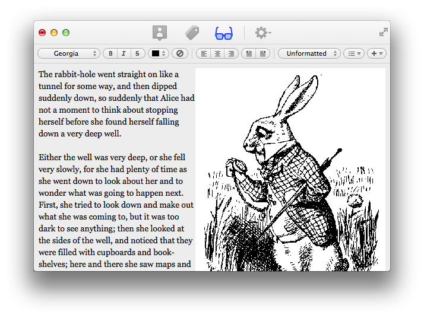

The story of Printpress
==========
Printpress is a native Mac client to manage your WordPress blogs, written mostly in Objective-C. This was version 1.x, my first attempt at creating a full-fledged Mac app in my spare time. Some of the code dates back to when I was in college and first learning Objective-C, and is a little rough. I decided rather than try to patch the existing, poor code base into a decent 2.0 release, I should rewrite Printpress from the ground up using more modern technologies like ARC and GCD. I currently have no timeline for release.

